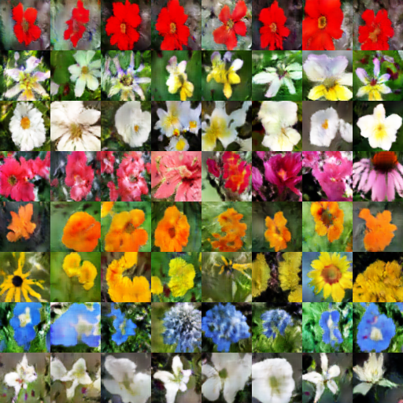

# Text To Image Synthesis 

This is a tensorflow implementation of synthesizing images. The images are synthesized using the GAN-CLS Algorithm from the paper [Generative Adversarial Text-to-Image Synthesis][2]. This implementation is built on top of the excellent [DCGAN in Tensorflow][3].

## Requirements
- [TensorFlow][4] 1.0+
- [TensorLayer](https://github.com/zsdonghao/tensorlayer) 1.4+
- [NLTK][8] : for tokenizer

## Codes
- `downloads.py` download Oxford-102 flower dataset and caption files(run this first).
- `data_loader.py` load data for further processing.
- `train_txt2im.py` train a text to image model.
- `utils.py` helper functions.
- `model.py` models.

## Results

- the flower shown has yellow anther red pistil and bright red petals.
- this flower has petals that are yellow, white and purple and has dark lines
- the petals on this flower are white with a yellow center
- this flower has a lot of small round pink petals.
- this flower is orange in color, and has petals that are ruffled and rounded.
- the flower has yellow petals and the center of it is brown
- this flower has petals that are blue and white.
- these white flowers have petals that start off white in color and end in a white towards the tips.

<a href="http://tensorlayer.readthedocs.io">

	

</a>

